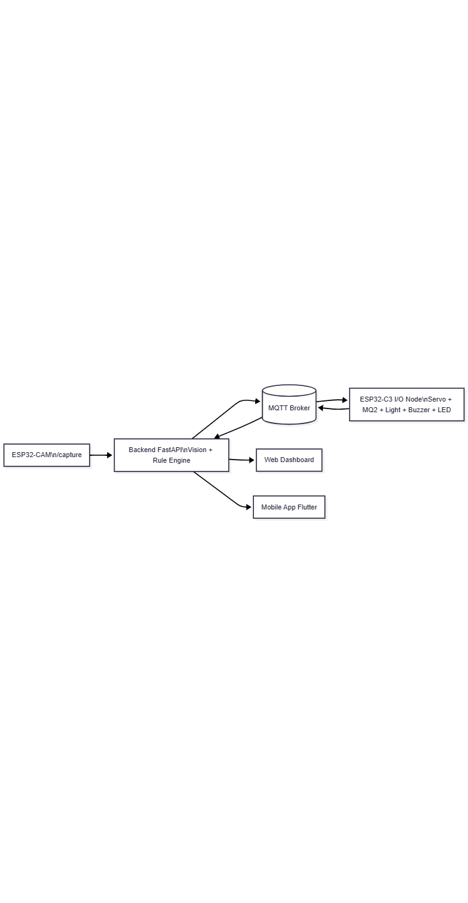
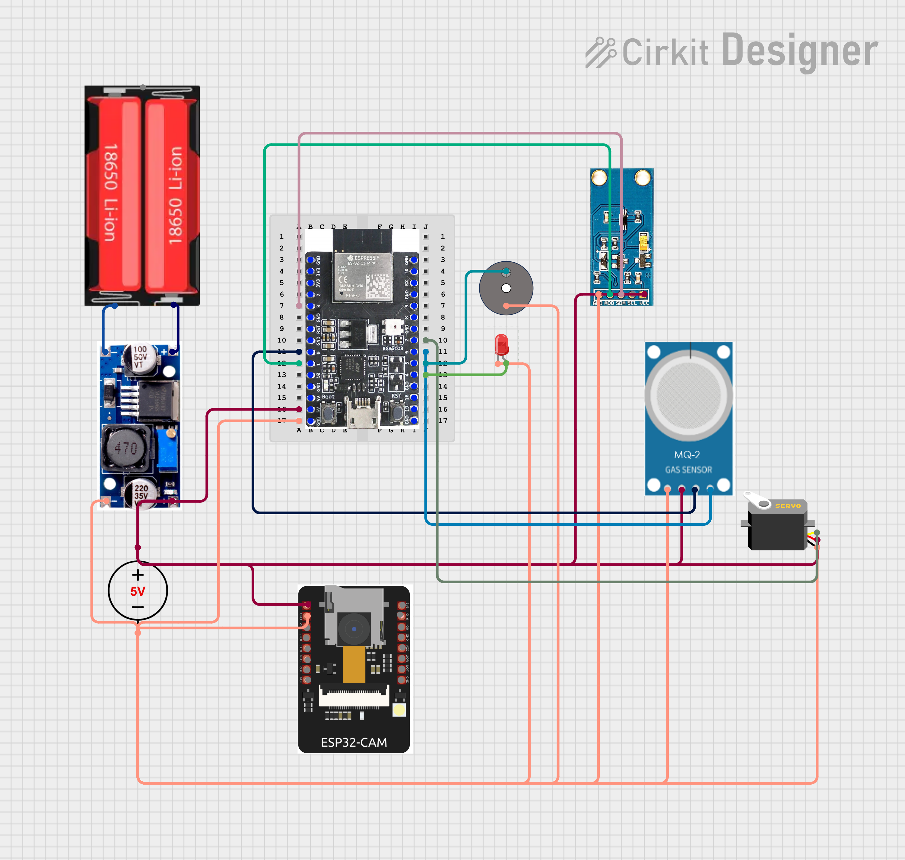
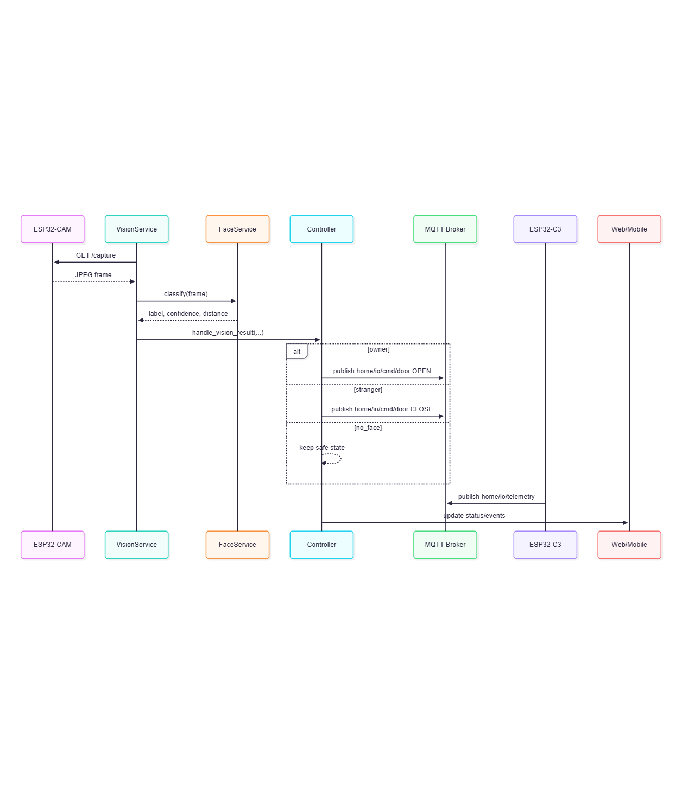
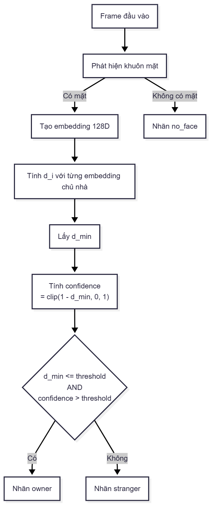
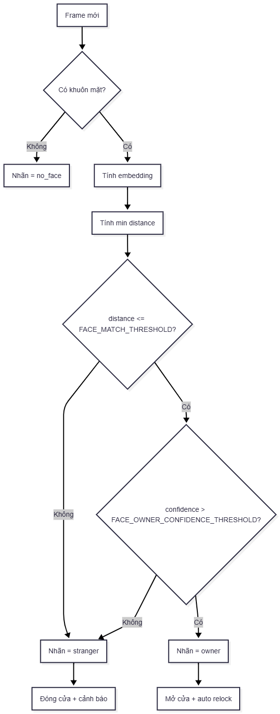
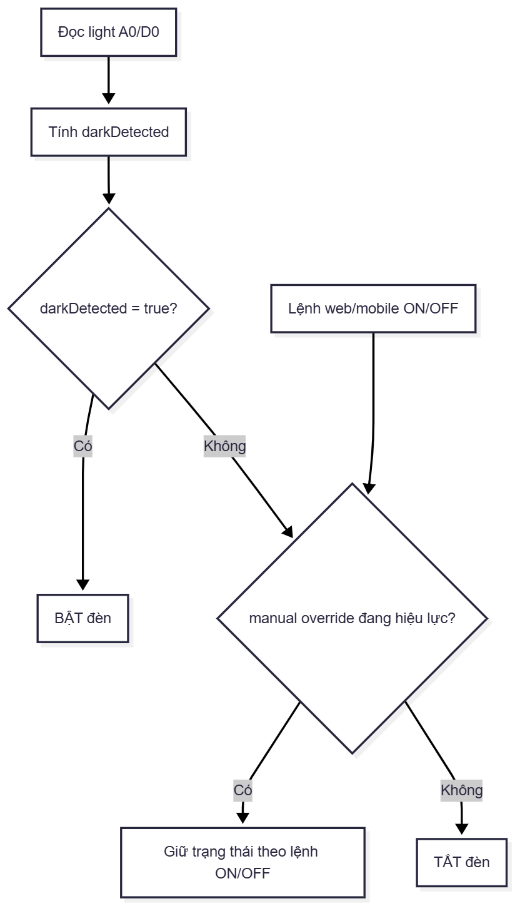
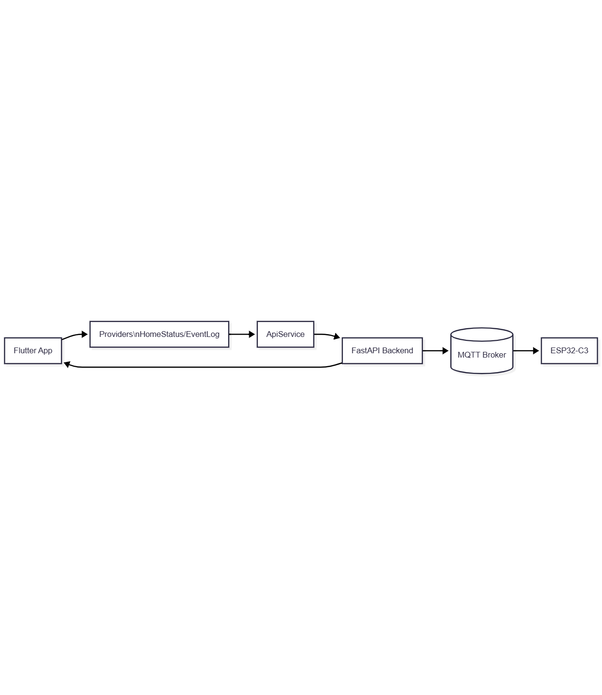
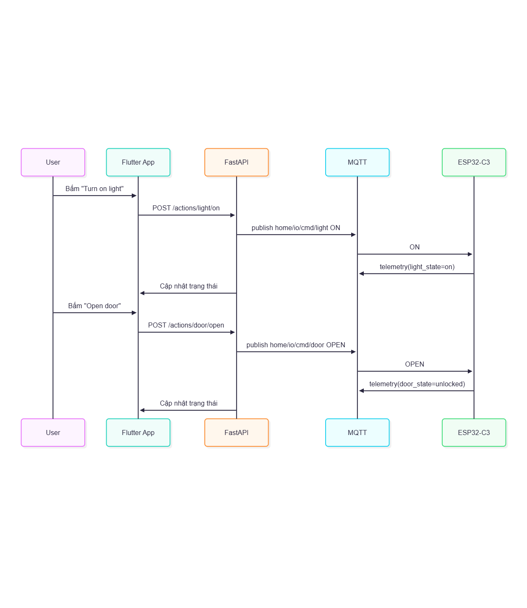

# BÁO CÁO MÔN HỌC VI ĐIỀU KHIỂN
## Đề tài: Hệ thống giám sát an ninh – môi trường thông minh ứng dụng cho nhà ở

**Phiên bản:** Draft v1.0  
**Ngày cập nhật:** 2026-05-16  
**Ngôn ngữ:** Tiếng Việt có dấu

---

## TRANG BÌA (PLACEHOLDER)

**ĐẠI HỌC ĐÀ NẴNG**  
**TRƯỜNG ĐẠI HỌC BÁCH KHOA**  
**KHOA CÔNG NGHỆ THÔNG TIN**

**BÁO CÁO MÔN HỌC VI ĐIỀU KHIỂN**

**ĐỀ TÀI:**  
**HỆ THỐNG GIÁM SÁT AN NINH – MÔI TRƯỜNG THÔNG MINH ỨNG DỤNG CHO NHÀ Ở**

- Sinh viên 1: `Nguyễn Thanh Hiếu` – `[Điền MSSV]`
- Sinh viên 2: `Nguyễn Mạnh Kiên` – `[Điền MSSV]`
- Sinh viên 3: `Nguyễn Văn Tiến` – `[Điền MSSV]`
- Nhóm HP: `[Điền nhóm HP]`
- CBHD: `[Điền tên giảng viên]`

Đà Nẵng, tháng `[Điền]` năm 2026

\newpage

## TÓM TẮT

Báo cáo trình bày quá trình thiết kế và triển khai một hệ thống giám sát an ninh kết hợp an toàn môi trường cho nhà ở, sử dụng kiến trúc IoT hai lớp gồm ESP32-CAM và ESP32-C3, phối hợp với backend Python và giao thức MQTT. Bài toán trọng tâm của đề tài là nhận diện khuôn mặt để mở/khóa cửa theo ngữ cảnh người dùng, đồng thời giám sát nồng độ khí gas và trạng thái ánh sáng để đưa ra hành động tự động nhằm đảm bảo an toàn. Nhóm lựa chọn hướng xử lý AI nhẹ dựa trên face embedding thay vì huấn luyện mô hình nặng, giúp giảm tài nguyên tính toán, tăng tính khả thi khi triển khai trên hạ tầng phần cứng chi phí thấp.  
Kết quả thực nghiệm cho thấy hệ thống đáp ứng được các luồng nghiệp vụ chính: nhận diện chủ nhà/người lạ/không có khuôn mặt, điều khiển khóa cửa vật lý bằng servo, phát cảnh báo khi gas vượt ngưỡng, và tự động bật đèn khi trời tối. Dashboard web và ứng dụng mobile do nhóm tự xây dựng cùng hỗ trợ giám sát trạng thái theo thời gian thực và cho phép can thiệp thủ công bằng các nút điều khiển. Bên cạnh đó, nhóm cũng ghi nhận và xử lý nhiều vấn đề thực địa như mất kết nối camera, xung đột session MQTT, sai cực tính cảm biến số, và độ ổn định nguồn cấp cho ESP32-CAM/servo.  
Đề tài đạt mục tiêu MVP và tạo nền tảng để mở rộng trong các hướng nâng cao như chống giả mạo khuôn mặt, tinh chỉnh ngưỡng theo dữ liệu vận hành dài hạn, bổ sung cảnh báo đa kênh và tăng độ tin cậy cơ điện cho ứng dụng dân dụng.

\newpage

## BẢNG PHÂN CÔNG NHIỆM VỤ

| Sinh viên | Nhiệm vụ chính | Mức hoàn thành | Ghi chú |
|---|---|---|---|
| `Nguyễn Thanh Hiếu` | Xử lý nhận biết người lạ bằng ESP32-CAM với AI nhẹ; thiết kế code và nghiệp vụ ESP32-C3 cho MQ2, light, servo, buzzer | `Đã hoàn thành` | `-` |
| `Nguyễn Mạnh Kiên` | Thiết kế ứng dụng mobile điều khiển và giám sát hệ thống | `Đã hoàn thành` | `-` |
| `Nguyễn Văn Tiến` | Thiết kế server để chạy kiểm thử web trước khi chuyển sang app; setup Docker, backend FastAPI, MQTT integration, logging, test matrix | `Đã hoàn thành` | `-` |
| `Cả nhóm` | Làm sản phẩm, kiểm thử, lắp phần cứng và viết báo cáo | `Đã hoàn thành` | `-` |

\newpage

## DANH MỤC HÌNH VẼ

- Hình 1.1. Sơ đồ khối tổng thể hệ thống
- Hình 2.1. Ảnh phần cứng tổng quan
- Hình 2.2. Sơ đồ nối dây ESP32-C3
- Hình 2.3. Sơ đồ cấp nguồn toàn hệ thống
- Hình 2.4. Sequence diagram luồng dữ liệu
- Hình 2.5. Sơ đồ module backend
- Hình 2.6. Flowchart nhận diện và ra quyết định
- Hình 2.7. Flowchart điều khiển đèn tự động + manual override
- Hình 2.8. Kiến trúc ứng dụng mobile và luồng gọi API
- Hình 2.9. Pipeline AI chi tiết và công thức quyết định nhãn
- Hình 3.1. Ảnh dashboard trạng thái hệ thống
- Hình 3.2. Ảnh demo mở/đóng cửa theo nhận diện
- Hình 3.3. Ảnh demo cảnh báo gas + buzzer
- Hình 3.4. Ảnh demo đèn tự bật khi tối
- Hình 3.5. Ảnh serial monitor của ESP32-CAM/ESP32-C3 khi test
- Hình 3.6. Ảnh mô hình lắp đặt thực tế
- Hình 3.7. Ảnh màn hình Home của app mobile
- Hình 3.8. Ảnh màn hình Events/Face của app mobile
- Hình 3.9. Ảnh demo điều khiển đèn/cửa từ app mobile
- Hình 3.10. Ảnh demo thiết bị thật trong quá trình vận hành

## DANH MỤC BẢNG

- Bảng 1.1. Danh sách yêu cầu chức năng và phi chức năng
- Bảng 2.1. BOM linh kiện
- Bảng 2.2. Pin mapping GPIO trên ESP32-C3
- Bảng 2.3. Đặc tả topic/payload MQTT
- Bảng 2.4. Cấu hình tham số và giá trị thực nghiệm
- Bảng 2.5. Mapping tính năng web và mobile
- Bảng 3.1. Ma trận test case và kết quả

\newpage

## MỤC LỤC

1. Giới thiệu  
2. Giải pháp  
2.1. Giải pháp phần cứng  
2.2. Giải pháp truyền thông  
2.3. Giải pháp phần mềm  
3. Kết quả và đánh giá  
4. Kết luận  
5. Tài liệu tham khảo

\newpage

# 1. GIỚI THIỆU

## 1.1 Bối cảnh bài toán

Trong bối cảnh đô thị hóa nhanh và xu hướng chuyển đổi số trong đời sống gia đình, nhu cầu về các hệ thống nhà thông minh ngày càng tăng. Tuy nhiên, phần lớn giải pháp thương mại hiện nay có chi phí đầu tư tương đối cao, đòi hỏi hệ sinh thái đóng và thiếu linh hoạt khi cần tùy biến cho từng hộ gia đình. Đối với các bài toán thực tế của một ngôi nhà, người dùng thường quan tâm đồng thời hai nhóm nhu cầu: **an ninh truy cập** và **an toàn môi trường sống**.  

Bài toán an ninh truy cập cần trả lời câu hỏi: ai đang đứng trước cửa, có phải chủ nhà không, và nếu không phải thì hệ thống phản ứng ra sao. Trong khi đó, bài toán an toàn môi trường tập trung vào các nguy cơ phổ biến như rò rỉ khí gas, điều kiện chiếu sáng không phù hợp, hay việc thiếu cảnh báo theo thời gian thực. Nếu giải quyết từng bài toán theo các hệ thống rời rạc, chi phí lắp đặt và vận hành tăng lên, đồng thời khó đồng bộ dữ liệu để đưa ra quyết định tự động.

Vì vậy, nhóm đề xuất một hệ thống tích hợp trên nền tảng vi điều khiển chi phí thấp, gồm camera, cảm biến, bộ chấp hành và backend điều phối trung tâm. Mục tiêu của giải pháp là đạt hiệu quả đủ tốt cho bối cảnh dân dụng, dễ triển khai, dễ bảo trì, đồng thời có thể mở rộng về sau.

## 1.2 Mục tiêu đề tài

Đề tài đặt ra bốn mục tiêu kỹ thuật chính:

1. Xây dựng cơ chế mở/khóa cửa bằng nhận diện khuôn mặt với ba trạng thái nhãn: `owner`, `stranger`, `no_face`.
2. Phát hiện khí gas vượt ngưỡng bằng cảm biến MQ2, phát cảnh báo tại chỗ và cập nhật lên dashboard.
3. Tự động điều khiển đèn phòng theo điều kiện ánh sáng môi trường, trời tối thì bật và trời sáng thì tắt, đồng thời cho phép điều khiển thủ công từ web và mobile.
4. Tạo giao diện giám sát theo thời gian thực có khả năng hiển thị trạng thái tổng hợp và ghi lại sự kiện vận hành.

Mục tiêu phụ bao gồm: giảm tài nguyên AI bằng phương pháp embedding nhẹ, đảm bảo tính ổn định giao tiếp MQTT, và xử lý được các lỗi thực địa thường gặp khi cấp nguồn hoặc chuyển đổi mạng.
## 1.3 Phạm vi triển khai MVP

Phạm vi MVP của nhóm tập trung vào khả năng hoạt động end-to-end trong môi trường LAN:

- **Thiết bị camera:** ESP32-CAM cung cấp endpoint `/capture` cho backend vision.
- **Thiết bị I/O:** ESP32-C3 đọc cảm biến và điều khiển servo/LED/buzzer.
- **Backend:** FastAPI xử lý nhận diện, điều phối rule engine, cung cấp API và dashboard.
- **Giao thức giao tiếp:** MQTT dùng cho lệnh điều khiển và telemetry.
- **UI giám sát:** Dashboard web chạy local qua Docker và app mobile Flutter.

Ngoài phạm vi ở phiên bản này:

- Chưa triển khai anti-spoofing chuyên sâu.
- Chưa triển khai hạ tầng cloud production và phân quyền người dùng nhiều cấp.
- Chưa triển khai tích hợp sâu với dịch vụ cảnh báo SMS/Call.

## 1.4 Yêu cầu hệ thống

### Bảng 1.1. Danh sách yêu cầu chức năng và phi chức năng

| Mã | Loại yêu cầu | Mô tả | Tiêu chí chấp nhận |
|---|---|---|---|
| FR-01 | Chức năng | Nhận diện khuôn mặt thành `owner/stranger/no_face` | Có nhãn và confidence trên dashboard |
| FR-02 | Chức năng | Mở cửa khi nhận diện owner | Servo chuyển trạng thái mở |
| FR-03 | Chức năng | Đóng cửa khi nhận diện stranger | Servo chuyển trạng thái đóng |
| FR-04 | Chức năng | Cảnh báo gas khi vượt ngưỡng | `gas_alert=true`, buzzer bật |
| FR-05 | Chức năng | Tự động bật đèn khi tối | LED phòng bật theo logic dark |
| FR-06 | Chức năng | Điều khiển thủ công đèn/cửa từ web và mobile | Nút bấm phản hồi đúng trạng thái |
| NFR-01 | Phi chức năng | Độ trễ chấp nhận được cho demo | Trải nghiệm điều khiển không giật cục |
| NFR-02 | Phi chức năng | Khả năng phục hồi kết nối MQTT | Tự reconnect và đồng bộ lại trạng thái |
| NFR-03 | Phi chức năng | Dễ triển khai trên LAN | Chạy được qua Docker + 2 ESP |
| NFR-04 | Phi chức năng | Tính mở rộng | Có thể bổ sung cảm biến/kênh cảnh báo |

## 1.5 Kiến trúc tổng quan và đóng góp

Hệ thống áp dụng kiến trúc tách lớp phần cứng rõ ràng: một nút camera chuyên trách thu hình, một nút I/O chuyên trách cảm biến và chấp hành, trong khi backend chịu trách nhiệm “ra quyết định thông minh” dựa trên dữ liệu tổng hợp. Thiết kế này giảm tải cho từng board, tăng khả năng thay thế linh kiện, đồng thời giúp quá trình debug nhanh hơn do có thể khoanh vùng lỗi theo lớp.


*Hình 1.1. Sơ đồ khối tổng thể hệ thống gồm ESP32-CAM, Backend, MQTT Broker, ESP32-C3, Dashboard/Web/App.*

Đóng góp chính của nhóm:

- Hoàn thiện pipeline nhận diện nhẹ dựa trên embedding và ngưỡng tùy chỉnh.
- Thiết kế rule engine kết hợp nhiều tín hiệu face, gas, light thay vì xử lý đơn lẻ.
- Triển khai cơ chế điều khiển thủ công và tự động đồng thời theo manual và auto logic.
- Ghi nhận và xử lý bài toán thực địa: nguồn cấp, timeout camera, xung đột MQTT, sai logic active level.

\newpage

# 2. GIẢI PHÁP

## 2.1 Giải pháp phần cứng

### 2.1.1 Danh sách linh kiện và vai trò

Giải pháp phần cứng được chọn theo tiêu chí: chi phí thấp, dễ mua, cộng đồng hỗ trợ lớn và phù hợp cho demo môn học. Nhóm sử dụng một camera module ESP32-CAM để lấy ảnh khuôn mặt, một board ESP32-C3 để làm node điều khiển I/O, cảm biến khí MQ2, cảm biến ánh sáng, servo SG90, LED và buzzer cảnh báo.

### Bảng 2.1. BOM linh kiện

| STT | Linh kiện | Số lượng | Thông số chính | Vai trò trong hệ thống |
|---|---|---:|---|---|
| 1 | ESP32-CAM AI Thinker | 1 | WiFi 2.4GHz, camera OV2640/OV3660 | Cung cấp ảnh `/capture` |
| 2 | ESP32-C3 DevKitM-1 | 1 | MCU RISC-V, ADC, WiFi | Đọc cảm biến, điều khiển actuator |
| 3 | Servo SG90 | 1 | 5V, góc quay 0-180 | Mô phỏng khóa cửa vật lý |
| 4 | MQ2 gas sensor module | 1 | A0 + D0, cấp 5V | Phát hiện nồng độ khí gas |
| 5 | Light sensor module | 1 | A0 + D0 | Xác định tối/sáng |
| 6 | LED 5mm | 1 | LED 2 chân | Đèn phòng mô phỏng |
| 7 | Passive buzzer 5V | 1 | Buzzer thụ động | Cảnh báo khí gas |
| 8 | Module hạ áp LM2596 | 1 | Hạ áp ổn định 5V | Cấp nguồn cho hệ thống |
| 9 | Pin Lithium 18650 Panasonic NCR 3400mAh 5A | 2 cell | Mắc nối tiếp | Nguồn đầu vào cho LM2596 |

### 2.1.2 Thiết kế nguồn cấp và phân phối nguồn

Một trong những nguyên nhân gây lỗi khó đoán nhất khi làm IoT là nguồn cấp không đủ dòng, đặc biệt khi camera và servo cùng hoạt động. Nhóm sử dụng 2 pin Lithium 18650 Panasonic NCR dung lượng 3400mAh dòng xả 5A mắc nối tiếp làm nguồn đầu vào, sau đó qua module LM2596 để hạ xuống 5V ổn định. Điện áp 5V này được cấp song song cho các nhánh tải chính: ESP32-CAM, ESP32-C3, servo, MQ2, cảm biến ánh sáng, buzzer. Tất cả thiết bị dùng chung GND để đảm bảo tham chiếu điện áp thống nhất.

Quy tắc nguồn áp dụng:

- Không cấp servo từ chân 3.3V của ESP32.
- Đường cấp servo đi riêng, nhưng nối GND chung với MCU.
- Nhóm dùng một nguồn chung và cấp song song cho các module; ưu tiên kiểm tra thực tế mức logic đầu ra của module cảm biến trước khi đấu vào GPIO.
- Bộ pin 2S đi qua LM2596 và được chỉnh chính xác mức ra 5V trước khi cấp tải.

### 2.1.3 Sơ đồ lắp mạch chi tiết ESP32-C3

Pin mapping hiện tại của firmware `esp32_io_node`:

### Bảng 2.2. Pin mapping GPIO trên ESP32-C3

| Chức năng | Chân ESP32-C3 | Ghi chú |
|---|---|---|
| Servo signal | GPIO7 | PWM điều khiển góc khóa |
| MQ2 A0 | GPIO0 | ADC1_CH0 |
| MQ2 D0 | GPIO6 | Digital input |
| Light A0 | GPIO1 | ADC1_CH1 |
| Light D0 | GPIO3 | Digital input |
| LED phòng | GPIO4 | LED 2 chân |
| Buzzer | GPIO5 | Passive buzzer 5V |


*Hình 2.1. Ảnh phần cứng tổng quan khi đã lắp hoàn chỉnh.*


*Hình 2.2. Sơ đồ nối dây chi tiết ESP32-C3 với servo, MQ2, cảm biến ánh sáng, LED, buzzer.*


*Hình 2.3. Sơ đồ cấp nguồn tổng thể với LM2596 5V, các nhánh tải và GND chung.*
### 2.1.4 Sơ đồ kết nối ESP32-CAM và ổn định camera

ESP32-CAM được cấu hình ưu tiên ổn định truyền ảnh:

- `PIXFORMAT_JPEG` để giảm tải băng thông và bộ nhớ.
- `FRAMESIZE_QVGA` để giảm độ trễ và hạn chế tràn buffer.
- `CAMERA_GRAB_LATEST` để bỏ frame cũ, lấy frame mới nhất.
- Cơ chế reconnect WiFi robust: scan SSID, retry nhiều vòng, log reason khi disconnect.

Trong quá trình triển khai thực tế, nhóm đã gặp các lỗi:

- `EV-VSYNC-OVF`: camera đứng sau một thời gian stream/capture.
- Camera không init khi tiếp xúc cáp ribbon không chắc hoặc nguồn không ổn định.
- Timeout `/capture` khi camera đổi IP hoặc không cùng mạng.

Các điểm kiểm soát quan trọng:

- Luôn kiểm tra IP thực tế qua serial log: `Camera Ready! Use 'http://<ip>' to connect`.
- Không mở `/stream` và chạy script `/capture` nặng cùng lúc trong thời gian dài.
- Dùng dây nguồn ngắn, cáp tốt, đầu nối chắc.

### 2.1.5 Thiết kế cấp nguồn thực tế và chống nhiễu

Trong mô hình triển khai thực tế, nhóm sử dụng **một nguồn chung** và cấp **song song** cho toàn bộ tải chính gồm ESP32-CAM, ESP32-C3, servo, cảm biến. Nguồn chung được tạo từ bộ pin 2S Lithium 18650 đi qua LM2596. Toàn hệ thống nối GND chung. Ở phiên bản hiện tại, nhóm **không sử dụng cầu chia áp rời** cho các chân cảm biến trong lúc demo, mà ưu tiên kiểm tra trực tiếp mức tín hiệu đầu ra của module khi vận hành thực tế.

Ngoài thiết kế cấp nguồn song song, nhóm bố trí thêm các nguyên tắc chống nhiễu:

- Dây tín hiệu tách xa dây nguồn servo khi có thể.
- Dùng ground star-point tương đối tại bus nguồn để giảm vòng nhiễu.
- Kiểm tra hướng cắm cảm biến/LED bằng test riêng từng phần tử trước khi tích hợp.

\newpage

## 2.2 Giải pháp truyền thông

### 2.2.1 Lý do chọn MQTT

MQTT phù hợp cho hệ IoT cỡ nhỏ vì mô hình publish/subscribe giúp tách rời producer và consumer. Trong đề tài này, backend đóng vai trò điều phối trung tâm, còn ESP32-C3 đóng vai trò thiết bị chấp hành/telemetry. Với cách tổ chức theo topic, nhóm dễ mở rộng thêm thiết bị và tác vụ mà không cần sửa giao thức lõi.

Ưu điểm khi áp dụng MQTT trong đề tài:

- Payload nhỏ, phù hợp tài nguyên vi điều khiển.
- Tách luồng lệnh (`cmd`) và luồng trạng thái (`telemetry`) rõ ràng.
- Dễ debug bằng log và tool MQTT client.
- Dễ tích hợp với dashboard web, app mobile và cloud về sau.

### 2.2.2 Thiết kế topic và payload

### Bảng 2.3. Đặc tả topic/payload MQTT

| Topic | Hướng truyền | Payload | Ý nghĩa |
|---|---|---|---|
| `home/io/cmd/door` | Backend -> ESP32-C3 | `OPEN` / `CLOSE` | Lệnh mở/đóng cửa |
| `home/io/cmd/light` | Backend -> ESP32-C3 | `ON` / `OFF` | Lệnh đèn thủ công |
| `home/io/telemetry` | ESP32-C3 -> Backend | JSON | Trạng thái gas, light, door |
| `home/vision/state` | Backend -> MQTT | JSON | Nhãn nhận diện và confidence |

Payload telemetry điển hình:

```json
{
  "gas_value": 1820,
  "gas_alert": true,
  "gas_d0": true,
  "light_value": 560,
  "dark": true,
  "door_state": "unlocked",
  "light_state": "on",
  "source": "esp32_c3_io"
}
```

### 2.2.3 Luồng dữ liệu end-to-end

1. ESP32-CAM cung cấp frame qua HTTP endpoint `/capture`.
2. Vision service của backend đọc frame định kỳ theo `VISION_INTERVAL_SEC`.
3. Face service classify ra `owner/stranger/no_face`, kèm confidence và distance.
4. Controller engine quyết định hành động:
   - owner: gửi lệnh mở cửa
   - stranger: gửi lệnh đóng cửa và phát sự kiện cảnh báo
   - no_face: giữ trạng thái an toàn
5. ESP32-C3 nhận lệnh MQTT, điều khiển servo/LED/buzzer theo rule.
6. ESP32-C3 publish telemetry lên backend để dashboard cập nhật realtime.


*Hình 2.4. Sequence luồng dữ liệu từ Camera đến Backend, MQTT, ESP32-C3 và Dashboard.*

### 2.2.4 Xử lý lỗi kết nối và tái kết nối

Trong triển khai thực tế, nhóm gặp hiện tượng ngắt kết nối MQTT lặp lại với log `MQTT_ERR_NO_CONN`. Phân tích cho thấy nguyên nhân chính là xung đột session client-id khi nhiều instance backend chạy đồng thời. Hướng khắc phục đã áp dụng:

- Tạo `client_id` động có hậu tố host/pid/random.
- Đảm bảo chỉ chạy một instance backend điều phối trong LAN demo.
- Ghi log kết nối/ngắt kết nối để truy vết nhanh.

Đối với camera, timeout xảy ra chủ yếu do đổi IP hoặc mất kết nối WiFi. Giải pháp là in IP ngay trên serial, cập nhật `ESP32_CAM_BASE_URL` trong `.env`, và triển khai reconnect logic ở firmware camera.

\newpage

## 2.3 Giải pháp phần mềm

### 2.3.1 Cấu trúc tổng thể phần mềm

Hệ phần mềm gồm ba lớp chính:

- **Firmware ESP32-CAM**: thu ảnh, cung cấp endpoint HTTP.
- **Firmware ESP32-C3**: đọc cảm biến, xử lý logic local, nhận lệnh MQTT, xuất telemetry.
- **Backend FastAPI**: nhận diện khuôn mặt, rule engine, API điều khiển, dashboard giám sát.

Luồng triển khai được container hóa với Docker Compose để giảm sai lệch môi trường giữa máy phát triển và máy demo.

### 2.3.2 Firmware ESP32-CAM

Firmware camera cấu hình profile “ổn định trước, chất lượng sau”:

- JPEG + QVGA để giảm kích thước frame.
- `grab latest` để tránh hàng đợi frame cũ gây lag.
- Retry WiFi nhiều lần, log reason khi disconnect.

Điểm mạnh của cách này là phù hợp cho mạng WiFi dân dụng, nơi độ ổn định thường thấp hơn môi trường lab.
### 2.3.3 Firmware ESP32-C3

Firmware I/O node hiện thực các tác vụ sau:

- Đọc MQ2 qua cả A0 (giá trị liên tục) và D0 (ngưỡng số).
- Đọc cảm biến ánh sáng qua A0/D0.
- Lọc nhiễu bằng smoothing đơn giản trên giá trị analog.
- Tính trạng thái tối/sáng có hysteresis để tránh nhấp nháy.
- Điều khiển servo khóa cửa, LED phòng, buzzer gas.
- Gửi telemetry chu kỳ lên MQTT.
- Nhận lệnh `OPEN/CLOSE` và `ON/OFF/AUTO` từ backend.

### 2.3.4 Backend FastAPI và rule engine

Backend có các module trọng tâm:

- `vision_service`: đọc frame camera theo chu kỳ.
- `face_service`: detect + encode + match embedding.
- `controller`: hợp nhất dữ liệu vision + telemetry và ra lệnh.
- `mqtt_service`: publish/subscribe topic với broker.
- `state_store` + `event_store`: quản lý trạng thái và nhật ký sự kiện.

Nguyên tắc của controller:

1. Ưu tiên an toàn: khi `gas_alert=true` thì mở cửa thoát hiểm.
2. Nhận diện owner mở cửa tự động và đặt hẹn giờ auto-relock.
3. Nhận diện stranger thì đóng cửa và ghi nhận cảnh báo.
4. Điều khiển đèn hỗn hợp auto + manual override.

### 2.3.5 Dashboard và API điều khiển

Backend cung cấp dashboard tại `/` và các endpoint phục vụ điều khiển/giám sát:

- `GET /api/v1/status`
- `GET /api/v1/events?limit=50`
- `POST /api/v1/door/open`
- `POST /api/v1/door/close`
- `POST /api/v1/light/on`
- `POST /api/v1/light/off`
- `POST /api/v1/face/reload`

Ngoài API thuần JSON, hệ thống còn có endpoint partial HTML để cập nhật trạng thái trong giao diện mà không tải lại toàn trang.

### 2.3.6 Logic nhận diện khuôn mặt “nhẹ”

Nhóm chọn chiến lược AI nhẹ để phù hợp tài nguyên tính toán của hệ thống.

Quy trình xử lý gồm 4 bước:

1. Phát hiện khuôn mặt từ khung hình camera.
2. Biến đổi khuôn mặt thành vector đặc trưng 128 chiều.
3. So sánh vector mới với tập vector chủ nhà đã lưu.
4. Ra quyết định nhãn dựa trên ngưỡng khoảng cách và ngưỡng tin cậy.

Gọi vector mới là `x`, vector mẫu chủ nhà thứ `i` là `e_i`. Khoảng cách được tính theo chuẩn Euclid:

`d_i = ||x - e_i||_2 = sqrt(sum_j (x_j - e_ij)^2 )`

Khoảng cách đại diện cho khung hình là:

`d_min = min_i d_i`

Điểm tin cậy nội bộ được chuẩn hóa từ khoảng cách:

`confidence = clip(1 - d_min, 0, 1)`

Trong đó `clip(a, 0, 1)` là chặn giá trị về đoạn từ 0 đến 1.

Quy tắc phân lớp hiện dùng:

- Nếu `d_min <= FACE_MATCH_THRESHOLD` và `confidence > FACE_OWNER_CONFIDENCE_THRESHOLD` thì nhãn là `owner`.
- Nếu có mặt nhưng không thỏa điều kiện trên thì nhãn là `stranger`.
- Nếu không phát hiện được mặt thì nhãn là `no_face`.

Với cấu hình hiện tại:

- `FACE_MATCH_THRESHOLD = 0.5`
- `FACE_OWNER_CONFIDENCE_THRESHOLD = 0.6`

Do `confidence = 1 - d_min`, điều kiện tin cậy `confidence > 0.6` tương đương `d_min < 0.4`. Như vậy hệ thống đang dùng hai lớp lọc đồng thời, giúp giảm nhận nhầm chủ nhà trong điều kiện ánh sáng xấu hoặc góc mặt lệch.

Để giảm dao động nhãn theo frame, hệ thống áp dụng cửa sổ làm mượt `FACE_SMOOTHING_WINDOW = 5`. Nhãn cuối cùng là nhãn xuất hiện ổn định trong cửa sổ gần nhất, thay vì dựa vào một frame đơn lẻ.


*Hình 2.9. Pipeline AI chi tiết từ phát hiện khuôn mặt đến quyết định nhãn.*

### 2.3.7 Luật điều khiển tích hợp

Luật điều khiển được chuẩn hóa theo tình huống:

- **owner** -> mở cửa (servo unlock), đặt lịch tự khóa sau `auto_relock_sec`.
- **stranger** -> đóng cửa, phát sự kiện cảnh báo xâm nhập.
- **gas_alert** -> mở cửa thoát hiểm ngay và bật buzzer.
- **dark_detected** -> bật đèn phòng tự động.
- **manual command** -> cho phép người dùng can thiệp ON/OFF đèn qua dashboard.

Đối với đèn, firmware xử lý `manual override` trong khoảng thời gian timeout để tránh xung đột điều khiển liên tục giữa auto và manual.

### 2.3.8 Tham số cấu hình quan trọng

### Bảng 2.4. Cấu hình tham số và giá trị thực nghiệm

| Nhóm | Tham số | Giá trị đang dùng | Vai trò |
|---|---|---|---|
| Camera | `ESP32_CAM_BASE_URL` | `http://10.104.86.173` | Endpoint camera hiện hành |
| Vision | `VISION_INTERVAL_SEC` | `1.0` | Chu kỳ đọc frame |
| Face | `FACE_MATCH_THRESHOLD` | `0.5` | Ngưỡng distance match |
| Face | `FACE_OWNER_CONFIDENCE_THRESHOLD` | `0.6` | Ngưỡng confidence owner |
| Face | `FACE_SMOOTHING_WINDOW` | `5` | Ổn định nhãn theo cửa sổ |
| Gas | `GAS_THRESHOLD` backend | `1800.0` | Ngưỡng cảnh báo tầng backend |
| Gas | `GAS_THRESHOLD` firmware | `1700` | Ngưỡng cảnh báo tầng thiết bị |
| Light | `LIGHT_DARK_THRESHOLD` | `2000` | Ngưỡng tối/sáng analog |
| Light | `LIGHT_HYSTERESIS` | `150` | Chống dao động ngưỡng |
| Alert | `stranger_alert_cooldown_sec` | `20` | Chống spam cảnh báo stranger |
| Alert | `gas_alert_cooldown_sec` | `20` | Chống spam cảnh báo gas |

### 2.3.9 Ứng dụng mobile do nhóm tự xây dựng

Nhóm phát triển ứng dụng mobile bằng Flutter để bổ sung kênh điều khiển từ điện thoại, với chức năng tương đương dashboard web:

- Polling trạng thái hệ thống qua `GET /api/v1/status` chu kỳ 2 giây.
- Polling danh sách sự kiện qua `GET /api/v1/events?limit=20` chu kỳ 3 giây.
- Điều khiển cửa qua `/actions/door/open` và `/actions/door/close`.
- Điều khiển đèn qua `/actions/light/on` và `/actions/light/off`.
- Hỗ trợ thay đổi `backend URL` ngay trong app để test khi đổi mạng.
- Hiển thị cảnh báo stranger theo sự kiện mới trong event log.

### Bảng 2.5. Mapping tính năng web và mobile

| Tính năng | Dashboard web | App mobile Flutter | Endpoint dùng chung |
|---|---|---|---|
| Xem trạng thái tổng hợp | Có | Có | `GET /api/v1/status` |
| Xem danh sách sự kiện | Có | Có | `GET /api/v1/events` |
| Mở/đóng cửa | Có | Có | `/actions/door/{action}` |
| Bật/tắt đèn | Có | Có | `/actions/light/{action}` |
| Reload face embeddings | Có | Có | `POST /api/v1/face/reload` |

> **[Hình 2.5 - Placeholder]** Sơ đồ module backend (services, stores, API).  

*Hình 2.6. Flowchart nhận diện và quyết định đóng hoặc mở cửa.*


*Hình 2.7. Flowchart điều khiển đèn tự động và ghi đè thủ công.*


*Hình 2.8. Kiến trúc app mobile với Provider và API service.*

### Mã 2.1. Đoạn mã classify/decision (ngắn)

```python
if owner_votes == len(encodings) and confidence > settings.face_owner_confidence_threshold:
    label = "owner"
else:
    label = "stranger"
```

### Mã 2.2. Đoạn mã publish telemetry (ngắn)

```cpp
payload += "\"gas_value\":" + String(gasRaw);
payload += ",\"gas_alert\":" + String(gasAlert ? "true" : "false");
payload += ",\"door_state\":\"" + doorState + "\"";
payload += ",\"light_state\":\"" + lightState + "\"";
```

\newpage

# 3. KẾT QUẢ VÀ ĐÁNH GIÁ

## 3.1 Môi trường kiểm thử

Hệ thống được kiểm thử trong mạng LAN/hotspot nội bộ, với camera và node điều khiển cùng truy cập vào một SSID. Backend và MQTT broker được chạy bằng Docker trên laptop để đơn giản hóa quy trình triển khai và tái lập.

Thông tin môi trường kiểm thử điển hình:

- Backend host: `10.104.86.2`
- ESP32-CAM base URL: `http://10.104.86.173`
- MQTT broker: `1883` (Mosquitto)
- Dashboard: `http://localhost:8000` hoặc `http://10.104.86.2:8000`

Kịch bản thử nghiệm được xây dựng theo định hướng “khả dụng trong thực tế dân dụng”, tức ưu tiên tính ổn định, phản ứng đúng trạng thái và khả năng tự phục hồi sau lỗi mạng.
## 3.2 Ma trận kiểm thử chức năng

### Bảng 3.1. Ma trận test case và kết quả

| ID | Kịch bản | Bước kiểm thử chính | Kết quả mong đợi | Kết quả thực tế | Đánh giá |
|---|---|---|---|---|---|
| T01 | Owner xuất hiện | Đứng trước camera, khung mặt rõ | Label owner, cửa mở | `[Điền]` | `[Pass/Fail]` |
| T02 | Stranger xuất hiện | Người lạ vào khung hình | Label stranger, cửa đóng | `[Điền]` | `[Pass/Fail]` |
| T03 | No face | Không có người trước camera | Label no_face, giữ trạng thái an toàn | `[Điền]` | `[Pass/Fail]` |
| T04 | Gas vượt ngưỡng | Kích hoạt MQ2 bằng nguồn khí mẫu | gas_alert=true, buzzer bật, cửa mở | `[Điền]` | `[Pass/Fail]` |
| T05 | Trời tối | Che cảm biến ánh sáng | dark=true, LED phòng bật | `[Điền]` | `[Pass/Fail]` |
| T06 | Trời sáng | Rọi đèn vào cảm biến | dark=false, LED phòng tắt | `[Điền]` | `[Pass/Fail]` |
| T07 | Điều khiển web đèn | Bấm ON/OFF trên dashboard | LED đổi trạng thái tương ứng | `[Điền]` | `[Pass/Fail]` |
| T08 | Điều khiển web cửa | Bấm OPEN/CLOSE | Servo đổi trạng thái tương ứng | `[Điền]` | `[Pass/Fail]` |
| T09 | Điều khiển mobile đèn | Bấm ON/OFF trên app mobile | LED đổi trạng thái tương ứng | `[Điền]` | `[Pass/Fail]` |
| T10 | Điều khiển mobile cửa | Bấm OPEN/CLOSE trên app mobile | Servo đổi trạng thái tương ứng | `[Điền]` | `[Pass/Fail]` |

## 3.3 Kết quả nhận diện khuôn mặt

Để đánh giá tính ổn định của nhận diện, nhóm chia thành ba nhóm test: `owner`, `stranger`, `no_face`. Các chỉ số theo dõi gồm:

- Tỷ lệ nhận đúng label theo từng nhóm.
- Độ ổn định nhãn qua nhiều frame liên tiếp.
- Độ nhạy với điều kiện ánh sáng và góc mặt.
- Tác động của ngưỡng `FACE_MATCH_THRESHOLD` và `FACE_OWNER_CONFIDENCE_THRESHOLD`.

Nhóm nhận thấy ngưỡng `FACE_OWNER_CONFIDENCE_THRESHOLD = 0.6` giúp giảm trường hợp nhận nhầm chủ nhà khi ảnh đầu vào nhiễu, đổi sáng đột ngột hoặc góc mặt lệch. Đổi lại, nếu đặt ngưỡng quá cao thì tỷ lệ bỏ sót chủ nhà cũng tăng. Vì vậy, hướng triển khai phù hợp là giữ cấu hình nền cho toàn hệ thống, sau đó hiệu chỉnh nhẹ theo điều kiện thực tế của từng vị trí lắp đặt.

## 3.4 Kết quả cảnh báo gas

Cảm biến MQ2 được đọc theo hai đường:

- Đường analog A0: phản ánh mức độ khí liên tục.
- Đường digital D0: trigger ngưỡng theo biến trở trên module.

Firmware kết hợp hai đường theo phép OR để tăng độ an toàn, giúp hệ thống phản ứng ngay cả khi một kênh có nhiễu cục bộ. Khi `gas_alert=true`, hệ thống đồng thời thực hiện các hành động:

1. Mở cửa thoát hiểm nếu cửa đang khóa.
2. Bật buzzer cảnh báo tại chỗ.
3. Gửi telemetry và sự kiện để web hiển thị.

Khi viết bản chính thức, cần bổ sung biểu đồ thay đổi `gas_value` theo thời gian ở kịch bản có/không có nguồn khí mẫu để minh họa định lượng rõ hơn.

> **[Hình 3.3 - Placeholder]** Ảnh demo gas alert trên dashboard và trạng thái buzzer.

## 3.5 Kết quả tự động bật đèn và điều khiển web/mobile

Phần điều khiển đèn có hai mode:

- **Auto mode:** dựa trên `darkDetected` từ cảm biến ánh sáng.
- **Manual mode:** nhận lệnh ON/OFF từ dashboard trong khoảng override timeout.

Nhóm đã xử lý hiện tượng LED sáng liên tục dù ánh sáng thay đổi bằng cách:

- Áp dụng hysteresis cho ngưỡng analog `LIGHT_HYSTERESIS`.
- Tách rõ nguồn quyết định dark giữa A0 và D0, mặc định ưu tiên A0.
- Bổ sung serial log đầy đủ `lightRaw`, `lightD0`, `darkA0`, `darkD0`, `dark`.

Kết quả cho thấy LED phản hồi ổn định hơn, giảm nhấp nháy khi giá trị ánh sáng dao động quanh ngưỡng.

> **[Hình 3.4 - Placeholder]** Ảnh demo đèn tự bật khi che cảm biến và tắt khi rọi sáng.  
> **[Hình 3.1 - Placeholder]** Ảnh dashboard hiển thị đồng thời gas, light, door, face.

## 3.6 Kết quả ứng dụng mobile

Ứng dụng mobile của nhóm cho phép giám sát và điều khiển tương tự web, phù hợp cho thao tác nhanh trên điện thoại:

- Màn hình Home hiển thị trạng thái `door`, `light`, `gas`, `face`, `confidence`.
- Màn hình Events/Face hiển thị sự kiện mới nhất, hỗ trợ cảnh báo stranger.
- Người dùng có thể đổi backend URL ngay trên app để thích ứng khi đổi mạng WiFi/hotspot.

Với kiến trúc dùng chung API backend, nhóm chỉ cần duy trì một tập endpoint và rule engine, giúp giảm trùng lặp logic giữa web và mobile.

> **[Hình 3.7 - Placeholder]** Ảnh màn hình Home app mobile.  
> **[Hình 3.8 - Placeholder]** Ảnh màn hình Events/Face app mobile.  

*Hình 3.9. Luồng điều khiển đèn và cửa từ app mobile qua backend và MQTT.*

## 3.7 Hình ảnh demo thiết bị thật

Nhóm bổ sung bộ ảnh demo thiết bị thật để minh họa tính khả thi của mô hình ngoài môi trường giả lập. Bộ ảnh này tập trung vào ba góc nhìn:

- Góc tổng thể mô hình đang chạy.
- Góc cận khu vực cảm biến và actuator.
- Góc thao tác thực nghiệm với đèn, cửa và cảnh báo gas.

Ảnh gốc đang được lưu trong thư mục `report-images`. Khi hoàn thiện bản nộp, nhóm chèn ảnh theo đúng mã hình để liên kết chặt với nội dung phân tích.


*Hình 3.6. Ảnh mô hình lắp đặt thực tế toàn cảnh.*


*Hình 3.10. Ảnh cận cảnh demo thiết bị thật trong lúc vận hành.*

## 3.8 Đánh giá tổng hợp

### Điểm mạnh

- Kiến trúc rõ ràng, tách node camera và node I/O giúp dễ debug.
- Tích hợp được cả an ninh face và door, đồng thời an toàn gas và light trong một hệ.
- Có dashboard theo dõi và điều khiển thời gian thực.
- Có quy trình vận hành, tài liệu wiring và checklist chạy hệ thống.

### Hạn chế

- Chưa có anti-spoofing nên vẫn có rủi ro giả mạo bằng ảnh/video.
- Chưa có dữ liệu dài hạn để tự động tối ưu ngưỡng theo mùa/điều kiện môi trường.
- Hạ tầng hiện tại thiên về LAN demo, chưa harden cho Internet công cộng.

### Rủi ro vận hành

- Mạng không ổn định sẽ ảnh hưởng trực tiếp tới độ tin cậy camera.
- Sai số cảm biến MQ2 cần thời gian warm-up và calibration định kỳ.
- Nếu cấu hình active-high/low không đúng, actuator có thể phản ứng ngược ý định.

\newpage

# 4. KẾT LUẬN

Đề tài đã hoàn thành một hệ thống giám sát an ninh – môi trường thông minh ở mức MVP có khả năng vận hành thực tế trong mạng nội bộ, đáp ứng đúng các mục tiêu cốt lõi đã đặt ra từ đầu. Nhóm đã triển khai thành công luồng nhận diện khuôn mặt với ba nhãn `owner`, `stranger`, `no_face`; điều khiển cửa bằng servo; giám sát và cảnh báo khí gas bằng MQ2; điều khiển đèn tự động theo ánh sáng; cùng với khả năng giám sát và thao tác thủ công qua dashboard web và ứng dụng mobile.

Bên cạnh phần chức năng, giá trị kỹ thuật lớn của đề tài nằm ở quá trình xử lý lỗi thực địa: từ lỗi camera treo, lỗi timeout do đổi IP, lỗi MQTT session collision, đến sai logic cảm biến và rủi ro nguồn cấp. Việc ghi log đầy đủ, tách lớp phần cứng/phần mềm và chuẩn hóa quy trình chạy hệ thống đã giúp nhóm rút ngắn thời gian debug đáng kể.

Về mặt học thuật, đề tài chứng minh rằng phương pháp AI nhẹ dựa trên embedding hoàn toàn khả thi cho bài toán nhà thông minh trong giới hạn tài nguyên của môn học. Cách tiếp cận này cân bằng tốt giữa độ chính xác, tốc độ phản hồi và chi phí triển khai. Trong phạm vi demo, hệ thống thể hiện được tính đồng bộ giữa perception (camera), reasoning (backend rule engine) và actuation (ESP32-C3).

## 4.1 Hướng phát triển

1. Bổ sung chống giả mạo khuôn mặt bằng kiểm tra sống anti spoofing và liveness.
2. Tối ưu cơ điện cho cụm khóa cửa, bổ sung cơ chế fail-safe khi mất điện.
3. Mở rộng kênh cảnh báo (Telegram/Zalo/SMS) thay vì chỉ dashboard/buzzer.
4. Xây dựng pipeline thu thập dữ liệu vận hành dài hạn để hiệu chỉnh ngưỡng tự động.
5. Bổ sung phân quyền người dùng, nhật ký truy cập và bảo mật API nâng cao.
6. Đóng gói triển khai edge + cloud để hỗ trợ truy cập từ xa an toàn.

\newpage

# 5. TÀI LIỆU THAM KHẢO

## 5.1 Tài liệu kỹ thuật phần cứng

1. Espressif Systems. *ESP32-C3 Series Datasheet*.  
2. Espressif Systems. *ESP-IDF Programming Guide – GPIO & Peripheral Reference (ESP32-C3)*.  
3. ESP32-CAM AI Thinker community documentation và nguồn ví dụ camera web server.  
4. MQ2 Gas Sensor Module datasheet và application note.  
5. SG90 Micro Servo datasheet.

## 5.2 Tài liệu phần mềm và giao thức

6. FastAPI official documentation.  
7. Eclipse Mosquitto documentation.  
8. Paho MQTT Python client documentation.  
9. `face_recognition` (dlib-based) documentation và examples.  
10. Flutter official documentation (state management, networking, platform setup).

## 5.3 Tài liệu nội bộ dự án

11. `docs/architecture.md` – Kiến trúc hệ thống.  
12. `docs/RUN_ALL.md` – Quy trình chạy full hệ thống.  
13. `docs/api.md` – API và MQTT topics.  
14. `docs/SUMMARY.md` – Tổng hợp thay đổi triển khai.  
15. `firmware/esp32_io_node/esp32_io_node.ino` – Firmware node điều khiển.  
16. `firmware/code_camera_esp32/code_camera_esp32.ino` – Firmware camera.  
17. `mobile/lib` – Source code ứng dụng mobile Flutter.
\newpage

# PHỤ LỤC A – DANH SÁCH PLACEHOLDER CẦN THAY BẰNG HÌNH THẬT

Ảnh chụp thực tế nhóm đã lưu trong thư mục `report-images`, hiện có file `circuit_image.png`.
Mã flow để dựng sơ đồ được lưu tại thư mục `report-flow-code`.

| Mã placeholder | Nội dung cần chèn | Nguồn ảnh đề xuất |
|---|---|---|
| Hình 1.1 | Sơ đồ khối tổng thể hệ thống | Vẽ draw.io hoặc Visio |
| Hình 2.1 | Ảnh phần cứng tổng quan | `report-images/circuit_image.png` (hoặc ảnh góc rộng hơn) |
| Hình 2.2 | Sơ đồ nối dây ESP32-C3 | `report-images/circuit_image.png` + chú thích pin, hoặc Fritzing |
| Hình 2.3 | Sơ đồ cấp nguồn | Sơ đồ khối nguồn buck + nhánh tải |
| Hình 2.4 | Sequence luồng dữ liệu | draw.io Mermaid/UML |
| Hình 2.5 | Module backend | Sơ đồ package/module |
| Hình 2.6 | Flow nhận diện và ra quyết định | Flowchart |
| Hình 2.7 | Flow điều khiển đèn auto/manual | Flowchart |
| Hình 2.8 | Kiến trúc app mobile | Flow app + service |
| Hình 2.9 | Pipeline AI chi tiết | `report-images/08_ai_pipeline_math_flow.png` |
| Hình 3.1 | Dashboard trạng thái | Screenshot web |
| Hình 3.2 | Demo mở/đóng cửa theo face | Ảnh/chuỗi ảnh/video frame |
| Hình 3.3 | Demo gas alert + buzzer | Screenshot + ảnh buzzer |
| Hình 3.4 | Demo auto light | Ảnh trước/sau che cảm biến |
| Hình 3.5 | Serial log debug | Screenshot serial monitor |
| Hình 3.6 | Mô hình lắp đặt thực tế | Ảnh tổng mô hình |
| Hình 3.7 | Màn hình Home mobile | Screenshot app |
| Hình 3.8 | Màn hình Events/Face mobile | Screenshot app |
| Hình 3.9 | Demo control từ mobile | Screenshot app |
| Hình 3.10 | Demo thiết bị thật | Ảnh chụp thực tế trong `report-images` |

\newpage

# PHỤ LỤC B – CHECKLIST HOÀN THIỆN TRƯỚC KHI NỘP

- [ ] Điền đầy đủ thông tin bìa (họ tên, MSSV, CBHD, nhóm HP).
- [ ] Cập nhật bảng phân công đúng người đúng việc.
- [ ] Chèn toàn bộ hình placeholder theo đúng mã hình.
- [ ] Chuẩn hóa chú thích hình (đặt dưới hình) và chú thích bảng (đặt trên bảng).
- [ ] Điền số liệu thật cho Bảng 3.1.
- [ ] Đối chiếu endpoint/topic với code hiện tại để tránh lệch tài liệu.
- [ ] Rà chính tả tiếng Việt có dấu.
- [ ] Căn format theo yêu cầu môn học:
  - Font Times New Roman 12
  - Justify
  - Line spacing 1.5
  - Spacing before 6pt
- [ ] Tự kiểm tra độ dài tối thiểu 30 trang sau khi dàn trang và chèn hình.
- [ ] Xuất PDF và kiểm tra lại lần cuối trên máy khác.

\newpage

# PHỤ LỤC C – GỢI Ý PHÂN BỔ TRANG KHI DÀN WORD (ĐẠT 32–36 TRANG)

| Khối nội dung | Số trang khuyến nghị |
|---|---:|
| Bìa + Tóm tắt + Phân công + Danh mục + Mục lục | 6–8 |
| Chương 1 – Giới thiệu | 4–5 |
| Chương 2 – Giải pháp phần cứng | 6–7 |
| Chương 2 – Giải pháp truyền thông | 3–4 |
| Chương 2 – Giải pháp phần mềm | 6–7 |
| Chương 3 – Kết quả và đánh giá | 8–10 |
| Chương 4 – Kết luận | 2–3 |
| Chương 5 – Tài liệu tham khảo | 1–2 |
| **Tổng cộng** | **32–36** |

Ghi chú triển khai: để đạt yêu cầu trang tối thiểu một cách tự nhiên, phần quan trọng nhất là chèn đúng các hình ảnh thực nghiệm, bảng số liệu đo và chú thích phân tích đi kèm. Không nên kéo dài báo cáo bằng câu văn lặp; thay vào đó, mỗi hình và mỗi bảng cần có đoạn diễn giải ý nghĩa kỹ thuật ngay sau khi chèn.

---

## KẾT THÚC BẢN THẢO

Bản thảo này đã được xây dựng theo đúng khung 5 phần của mẫu báo cáo môn học, bám sát kiến trúc và mã nguồn hiện tại của dự án, đồng thời tích hợp đầy đủ placeholder cho sơ đồ, ảnh lắp mạch, kết quả demo và bảng đánh giá định lượng.
